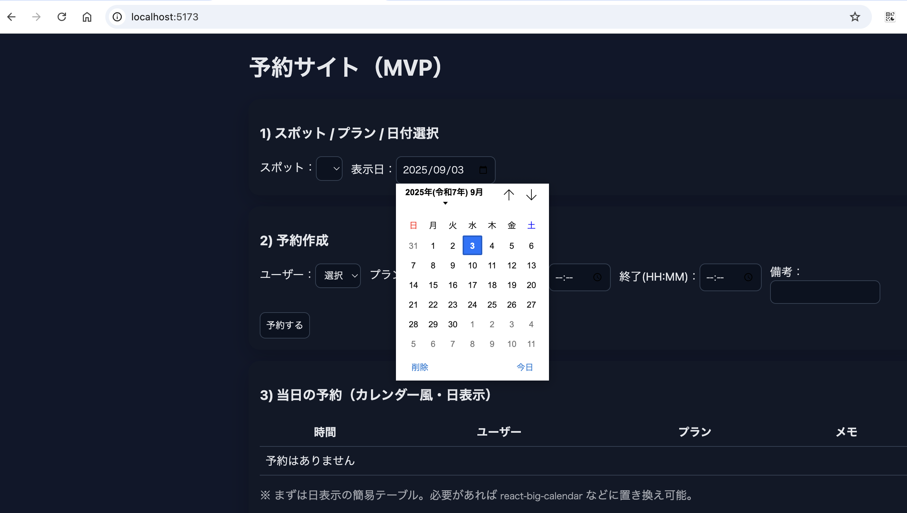

# 予約アプリ（汎用ver）

## 概要
基礎的なfrontend/backendの勉強をしていたときの資料を叩き台にして構築した **汎用予約アプリ** です。  
ユーザー（`users`）が、予約サイト（`booking_spots`）に紐づくプラン（`plans`）を選び、日時を指定して予約（`reservations`）できます。  
**CRUD + API 設計 + 重複予約防止** を最小構成で実装しました。

## 技術スタック
- Backend: Flask + SQLAlchemy + SQLite（ポート `8000`）
- Frontend: React + Vite（ポート `5173`）
- 時刻: サーバ保存は UTC（`Z` 付き ISO）。表示はブラウザ依存。

### 現状できること
**フロント**で予約作成／当日一覧を表示。  
**マスタ**（ユーザー／スポット／プラン）は現状 API で作成します。
- 予約スポットの登録／取得（API）
- ユーザーの登録／取得（API）
- プランの登録／取得（API）
- 予約の作成／一覧／取得／更新／削除（API）
- 予約作成フォーム（フロント）
- 当日予約の簡易一覧（フロント）
- 予約の重複チェック（同一プラン上の時間帯重複は 409）

### 今後の展望（未対応分）
- マスタ管理UI（ユーザー／スポット／プランの画面）
- 週／月カレンダー表示（react-big-calendar など）
- 認証（ログイン／JWT）
- 入力バリデーションの強化（フロント）
- Docker / デプロイ手順

## 立ち上げ画面


### バックエンド起動
```bash
cd backend
python -m venv .venv
source .venv/bin/activate            # Windows: .\.venv\Scripts\Activate.ps1
pip install -r requirements.txt
python -m app.seed                   # 初期データ投入（任意）
FLASK_APP=app.app FLASK_RUN_PORT=8000 flask run
# -> http://127.0.0.1:8000/api/health が { "ok": true } ならOK
```
### フロントエンド起動
```bash
cd frontend/booking-frontend
npm install
npm run dev
# -> http://localhost:5173
```
---

## エンティティと関係
### 関係図（ER 図イメージ）
```text
users (1) ──< reservations >── (1) plans (N) ──< booking_spots (1)
                         ^
                         |
                       belongs to plan → each plan belongs to one booking_spots
```
- `users` … 予約者  
- `booking_spots` … プランを提供する予約管理・実施場所
- `plans` … 予約サイトが提供する予約対象（"plan A"など）  
- `reservations` … 誰が・どのプランを・いつ利用するか

---
## DB設計
### users
```sql
- user_id (PK): INT
- name: VARCHAR NOT NULL
- email: VARCHAR UNIQUE  -- NULL 可。非NULLなら一意
- tel: VARCHAR
- created_at: TIMESTAMP DEFAULT CURRENT_TIMESTAMP
```
### booking_spots
```sql
-- 予約スポット（拠点・施設・店舗など）
- booking_spot_id (PK): INT
- name: VARCHAR NOT NULL
- address: VARCHAR
- url: VARCHAR
- email: VARCHAR UNIQUE  -- NULL 可。非NULLなら一意
- tel: VARCHAR
- created_at: TIMESTAMP DEFAULT CURRENT_TIMESTAMP
```
### plans
```sql
- plan_id (PK): INT
- booking_spot_id (FK → booking_spots.booking_spot_id) INT NOT NULL
- plan_name: VARCHAR NOT NULL                 -- 例: プランA
- description: VARCHAR
- price_yen: INT NOT NULL DEFAULT 0
- default_duration_min: INT NOT NULL DEFAULT 60
- created_at: TIMESTAMP DEFAULT CURRENT_TIMESTAMP

-- 推奨: 同一スポット内での重複名を禁止
-- UNIQUE(booking_spot_id, name)
```
### reservations
```sql
- reservation_id (PK): INT
- user_id (FK → users.user_id) INT NOT NULL
- plan_id (FK → plans.plan_id) INT NOT NULL
- start_datetime: DATETIME NOT NULL
- end_datetime:   DATETIME NOT NULL
- note: TEXT
- created_at: TIMESTAMP DEFAULT CURRENT_TIMESTAMP

-- 業務ルール例（アプリ側バリデーションで実施）
-- 1) end_datetime > start_datetime
-- 2) 同一プランでの時間重複の禁止（[start, end) 区間重複を排除）

-- 推奨INDEX:
-- INDEX(plan_id, start_datetime, end_datetime)
-- INDEX(start_datetime)
```
---
## API設計（予約サイト化 / 任意プラン / カレンダー表示）
本APIは `users / booking_spots / plans / reservations` を中心に、  
**予約作成～一覧～更新/削除** と **カレンダー表示（Day/Week/Month）** を提供します。  
データモデルは以下のDB設計に準拠します（nameは全テーブル統一）。

## 共通仕様
- ベースURL例: `https://api.example.com`
- 形式: JSON（`application/json`）
- 日時: **ISO 8601**（例: `2025-09-05T15:00:00Z`）。保存はUTC、入出力でローカルTZ指定可。
- タイムゾーン: クエリ `tz`（IANA文字列、例: `Asia/Tokyo`）で指定。未指定時はUTC。
- ページング: `?page=1&per_page=50`（デフォルト `page=1, per_page=50`, 最大 `per_page=200`）
- ソート: `?sort=created_at:desc` のように `field:asc|desc` をカンマ区切りで指定
- エラーフォーマット（統一）
  ```json
  { "error": { "code": "string", "message": "human readable", "details": {...} } }

### 1) ヘルスチェック
GET /api/health
```json
Response 200:
{
  "ok": true
}
```

### 2) Users（予約者）
POST /api/users
```json
Request Body:
{
  "name": "山田太郎",
  "email": "taro@example.com",
  "tel": "090-xxxx-xxxx"
}

Response 201:
{
  "user_id": 101,
  "name": "山田太郎",
  "email": "taro@example.com",
  "tel": "090-xxxx-xxxx",
  "created_at": "2025-09-03T08:00:00Z"
}
```

GET /api/users
```json
Response 200:
{
  "data": [
    {
      "user_id": 101,
      "name": "山田太郎",
      "email": "taro@example.com",
      "tel": "090-xxxx-xxxx"
    }
  ],
  "page": 1,
  "per_page": 50,
  "total": 1
}
```

### 3) Booking Spots（予約スポット）
POST /api/booking_spots
```json
Request Body:
{
  "name": "渋谷ラボ",
  "address": "東京都渋谷区...",
  "url": "https://example.com",
  "email": "info@example.com",
  "tel": "03-xxxx-xxxx"
}

Response 201:
{
  "booking_spot_id": 1,
  "name": "渋谷ラボ",
  "address": "東京都渋谷区...",
  "url": "https://example.com",
  "email": "info@example.com",
  "tel": "03-xxxx-xxxx"
}
```

GET /api/booking_spots
```json
Response 200:
{
  "data": [
    {
      "booking_spot_id": 1,
      "name": "渋谷ラボ",
      "address": "東京都渋谷区..."
    }
  ],
  "page": 1,
  "per_page": 50,
  "total": 1
}
```

### 4) Plans（任意プラン）
POST /api/booking_spots/{booking_spot_id}/plans
```json
Request Body:
{
  "name": "プランA",
  "description": "ベーシック",
  "price_yen": 8000,
  "default_duration_min": 60
}

Response 201:
{
  "plan_id": 10,
  "booking_spot_id": 1,
  "name": "プランA",
  "price_yen": 8000,
  "default_duration_min": 60
}
```

GET /api/booking_spots/{booking_spot_id}/plans
```json
Response 200:
{
  "data": [
    { "plan_id": 10, "name": "プランA", "price_yen": 8000 }
  ]
}
```
### 5) Reservations（予約）
POST /api/reservations
```json
Request Body:
{
  "user_id": 101,
  "plan_id": 10,
  "start_datetime": "2025-09-05T06:00:00Z",
  "end_datetime": "2025-09-05T07:00:00Z",
  "note": "備考"
}

Response 201:
{
  "reservation_id": 5001,
  "message": "created"
}
```
GET /api/reservations?date=2025-09-XX
```json
Response 200:
{
  "data": [
    {
      "reservation_id": 5001,
      "user": { "user_id": 101, "name": "山田太郎" },
      "plan": { "plan_id": 10, "name": "プランA", "booking_spot_id": 1 },
      "start_datetime": "2025-09-05T06:00:00Z",
      "end_datetime": "2025-09-05T07:00:00Z",
      "note": "備考"
    }
  ],
  "page": 1,
  "per_page": 50,
  "total": 1
}
```

### 6) Calendar View API
GET /api/calendar?scope=week&date=2025-09-01&tz=Asia/Tokyo
```json
Response 200:
{
  "scope": "week",
  "start": "2025-09-01T00:00:00+09:00",
  "end":   "2025-09-08T00:00:00+09:00",
  "events": [
    {
      "id": 5001,
      "title": "プランA / 山田太郎",
      "plan_id": 10,
      "booking_spot_id": 1,
      "start": "2025-09-05T15:00:00+09:00",
      "end":   "2025-09-05T16:00:00+09:00",
      "meta": { "user_id": 101, "note": "備考" }
    }
  ]
}
```

### エラー応答
#### 400 Bad Request（バリデーションエラー）
```json
{
  "error": {
    "code": "VALIDATION_ERROR",
    "message": "start_datetime is required",
    "details": {
      "field": "start_datetime",　-- データ項目（カラム、プロパティ、入力欄） を指す
      "reason": "missing"
    }
  }
}
```
#### 401 Unauthorized（認証エラー）
```json
{
  "error": {
    "code": "UNAUTHORIZED",
    "message": "Authentication token is missing or invalid"
  }
}
```
#### 404 Not Found（リソース未発見）
```json
{
  "error": {
    "code": "NOT_FOUND",
    "message": "plan not found",
    "details": {
      "plan_id": 999
    }
  }
}
```
#### 409 Conflict（重複予約）
```json
{
  "error": {
    "code": "NOT_FOUND",
    "message": "plan not found",
    "details": {
      "plan_id": 999
    }
  }
}
```
#### 422 Unprocessable Entity（意味的に不正な入力）
```json
{
  "error": {
    "code": "UNPROCESSABLE_ENTITY",
    "message": "end_datetime must be later than start_datetime",
    "details": {
      "start_datetime": "2025-09-05T07:00:00Z",
      "end_datetime": "2025-09-05T06:00:00Z"
    }
  }
}
```


